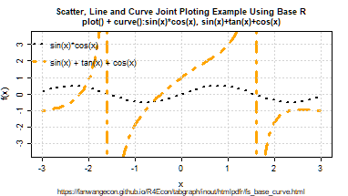
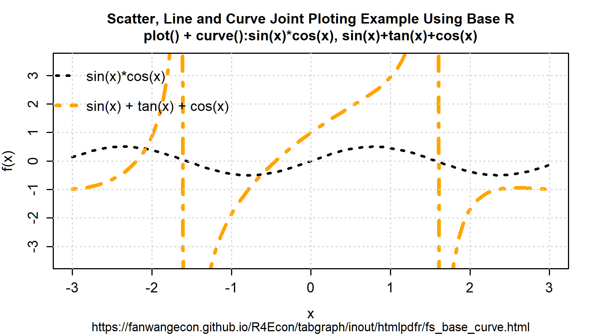
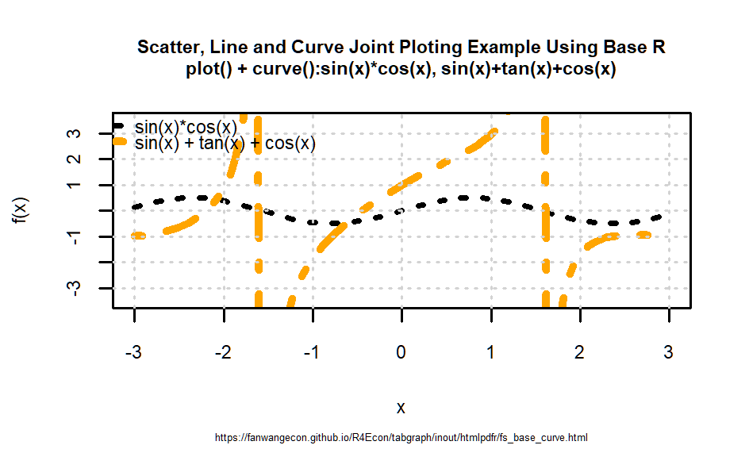
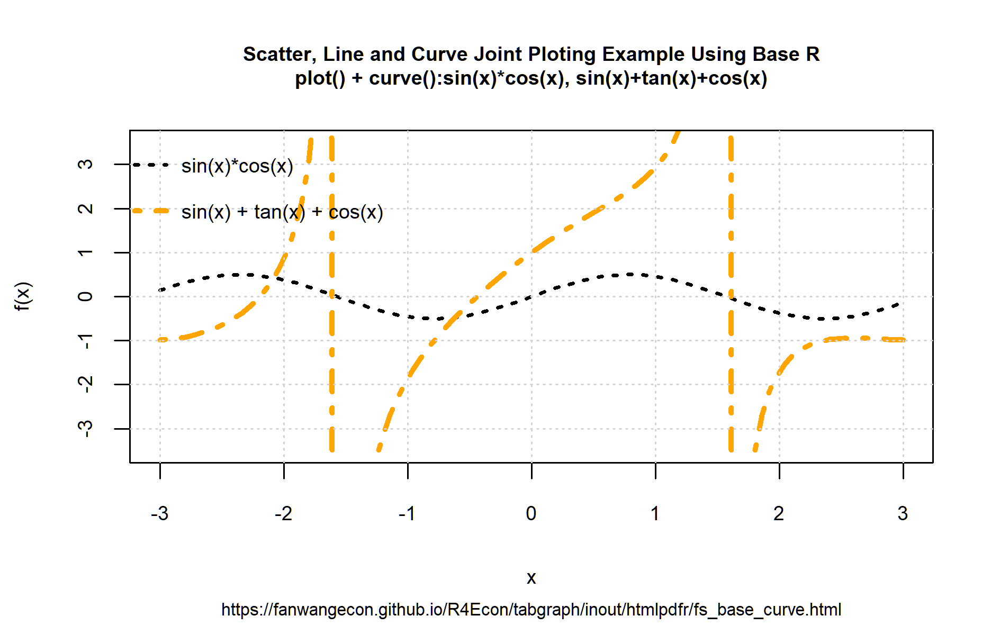

### Import and Export Images

```{r global_options, include = FALSE}
try(source("../../.Rprofile"))
```

`r text_shared_preamble_one`
`r text_shared_preamble_two`
`r text_shared_preamble_thr`

Work with the R plot function.

#### Export Images Different Formats with Plot()

##### Generate and Record A Plot

Generate a graph and recordPlot() it. The generated graph does not have legends Yet. Crucially, there are no titles, legends, axis, labels in the figures. As we stack the figures together, do not add those. Only add at the end jointly for all figure elements together to control at one spot things.

```{r,echo = T, results = 'hide', fig.show = 'hide'}

#######################################################
# First, Strings
#######################################################
# Labeling
st_title <- paste0('Scatter, Line and Curve Joint Ploting Example Using Base R\n',
                   'plot() + curve():sin(x)*cos(x), sin(x)+tan(x)+cos(x)')
st_subtitle <- paste0('https://fanwangecon.github.io/',
                      'R4Econ/tabgraph/inout/htmlpdfr/fs_base_curve.html')
st_x_label <- 'x'
st_y_label <- 'f(x)'

#######################################################
# Second, functions
#######################################################
fc_sin_cos_diff <- function(x) sin(x)*cos(x)
st_line_3_y_legend <- 'sin(x)*cos(x)'
fc_sin_cos_tan <- function(x) sin(x) + cos(x) + tan(x)
st_line_4_y_legend <- 'sin(x) + tan(x) + cos(x)'

#######################################################
# Third, patterns
#######################################################
st_line_3_black <- 'black'
st_line_4_purple <- 'orange'
# line type
st_line_3_lty <- 'dotted'
st_line_4_lty <- 'dotdash'
# line width
st_line_3_lwd <- 2.5
st_line_4_lwd <- 3.5

#######################################################
# Fourth: Share xlim and ylim
#######################################################
ar_xlim = c(-3, 3)
ar_ylim = c(-3.5, 3.5)

#######################################################
# Fifth: Even margins
#######################################################
par(new=FALSE)

#######################################################
# Sixth, the four objects and do not print yet:
#######################################################
# Graph Curve 3
par(new=T)
curve(fc_sin_cos_diff,
      col = st_line_3_black,
      lwd = st_line_3_lwd, lty = st_line_3_lty,
      from = ar_xlim[1], to = ar_xlim[2], ylim = ar_ylim,
      ylab = '', xlab = '', yaxt='n', xaxt='n', ann=FALSE)
# Graph Curve 4
par(new=T)
curve(fc_sin_cos_tan,
      col = st_line_4_purple,
      lwd = st_line_4_lwd, lty = st_line_4_lty,
      from = ar_xlim[1], to = ar_xlim[2], ylim = ar_ylim,
      ylab = '', xlab = '', yaxt='n', xaxt='n', ann=FALSE)
pl_curves_save <- recordPlot()
```

##### Generate Large Font and Small Font Versions of PLot

Generate larger font version:

```{r,echo = T, results = 'hide', fig.show = 'hide'}
# Replay
pl_curves_save

#######################################################
# Seventh, Set Title and Legend and Plot Jointly
#######################################################
# CEX sizing Contorl Titling and Legend Sizes
fl_ces_fig_reg = 0.75
fl_ces_fig_leg = 0.75
fl_ces_fig_small = 0.65

# R Legend
title(main = st_title, sub = st_subtitle, xlab = st_x_label, ylab = st_y_label,
      cex.lab=fl_ces_fig_reg,
      cex.main=fl_ces_fig_reg,
      cex.sub=fl_ces_fig_small)
axis(1, cex.axis=fl_ces_fig_reg)
axis(2, cex.axis=fl_ces_fig_reg)
grid()

# Legend sizing CEX
legend("topleft",
       bg="transparent",
       bty = "n",
       c(st_line_3_y_legend, st_line_4_y_legend),
       col = c(st_line_3_black, st_line_4_purple),
       pch = c(NA, NA),
       cex = fl_ces_fig_leg,
       lty = c(st_line_3_lty, st_line_4_lty),
       lwd = c(st_line_3_lwd,st_line_4_lwd),
       y.intersp=2)

# record final plot
pl_curves_large <- recordPlot()
dev.off()
```

Generate smaller font version:

```{r,echo = T, results = 'hide', fig.show = 'hide'}
# Replay
pl_curves_save

#######################################################
# Seventh, Set Title and Legend and Plot Jointly
#######################################################
# CEX sizing Contorl Titling and Legend Sizes
fl_ces_fig_reg = 0.45
fl_ces_fig_leg = 0.45
fl_ces_fig_small = 0.25

# R Legend
title(main = st_title, sub = st_subtitle, xlab = st_x_label, ylab = st_y_label,
      cex.lab=fl_ces_fig_reg,
      cex.main=fl_ces_fig_reg,
      cex.sub=fl_ces_fig_small)
axis(1, cex.axis=fl_ces_fig_reg)
axis(2, cex.axis=fl_ces_fig_reg)
grid()

# Legend sizing CEX
legend("topleft",
       bg="transparent",
       bty = "n",
       c(st_line_3_y_legend, st_line_4_y_legend),
       col = c(st_line_3_black, st_line_4_purple),
       pch = c(NA, NA),
       cex = fl_ces_fig_leg,
       lty = c(st_line_3_lty, st_line_4_lty),
       lwd = c(st_line_3_lwd,st_line_4_lwd),
       y.intersp=2)

# record final plot
pl_curves_small <- recordPlot()
dev.off()
```

##### Save Plot with Varying Resolutions and Heights

Export recorded plot.

A4 paper is 8.3 x 11.7, with 1 inch margins, the remaining area is 6.3 x 9.7. For figures that should take half of the page, the height should be 4.8 inch. One third of a page should be 3.2 inch. 6.3 inch is 160mm and 3 inch is 76 mm. In the example below, use

```{r}
# Store both in within folder directory and root image directory:
# C:\Users\fan\R4Econ\tabgraph\inout\_img
# C:\Users\fan\R4Econ\_img
# need to store in both because bookdown and indi pdf path differ.
# Wrap in try because will not work underbookdown, but images already created

ls_spt_root <- c('..//..//', '')
spt_prefix <- '_img/fs_img_io_2curve'

for (spt_root in ls_spt_root) {
  # Changing pointsize will not change font sizes inside, just rescale
  # PNG 72
  try(png(paste0(spt_root, spt_prefix, "_w135h76_res72.png"),
      width = 135 , height = 76, units='mm', res = 72, pointsize=7))
  print(pl_curves_large)
  dev.off()
  # PNG 300
  try(png(paste0(spt_root, spt_prefix, "_w135h76_res300.png"),
      width = 135, height = 76, units='mm', res = 300, pointsize=7))
  print(pl_curves_large)
  dev.off()
  # PNG 300, SMALL, POINT SIZE LOWER
  try(png(paste0(spt_root, spt_prefix, "_w80h48_res300.png"),
      width = 80, height = 48, units='mm', res = 300, pointsize=7))
  print(pl_curves_small)
  dev.off()
  # PNG 300
  try(png(paste0(spt_root, spt_prefix, "_w160h100_res300.png"),
      width = 160, height = 100, units='mm', res = 300))
  print(pl_curves_large)
  dev.off()

  # EPS
  setEPS()
  try(postscript(paste0(spt_root, spt_prefix, "_fs_2curve.eps")))
  print(pl_curves_large)
  dev.off()
}
```


##### Low and High Resolution Figure

The standard resolution often produces very low quality images. Resolution should be increased. See figure comparison.

<center></center><br />
<center></center>
\begin{figure}
\centering
\caption{RES=72 (DEFAULT R) TOP, RES=300 Bottom, (Width=160, Height=81, PNG)}
\includegraphics[width=\linewidth]{_img/fs_img_io_2curve_w135h76_res72.png}
\hfill
\centering
\includegraphics[width=\linewidth]{_img/fs_img_io_2curve_w135h76_res300.png}
\end{figure}

##### Smaller and Larger Figures

Smaller and larger figures with different font size comparison. Note that earlier, we generated the figure without legends, labels, etc first, recorded the figure. Then we associated the same underlying figure with differently sized titles, legends, axis, labels.

<center></center><br />
<center></center>
\begin{figure}
\centering
\caption{Top Small (small font saved), Bottom Large, PNG}
\includegraphics[width=\linewidth]{_img/fs_img_io_2curve_w80h48_res300.png}
\hfill
\centering
\includegraphics[width=\linewidth]{_img/fs_img_io_2curve_w160h100_res300.png}
\end{figure}
